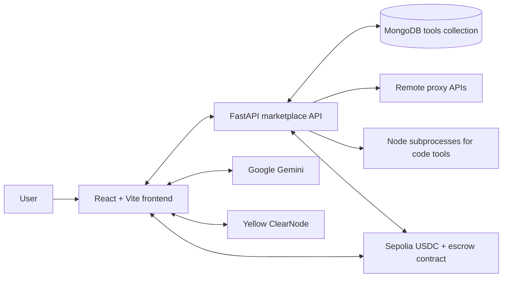
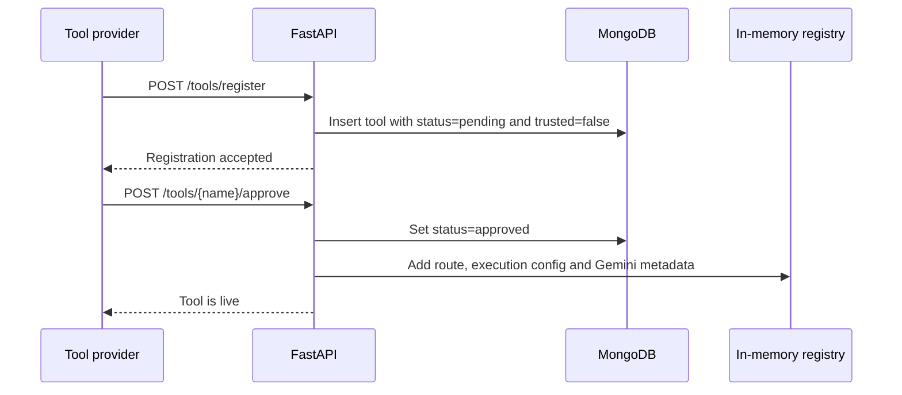
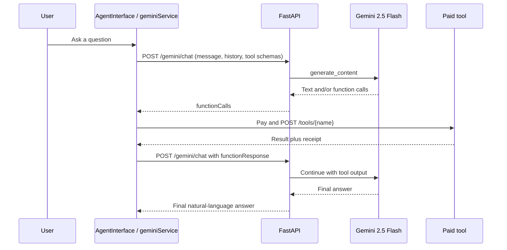
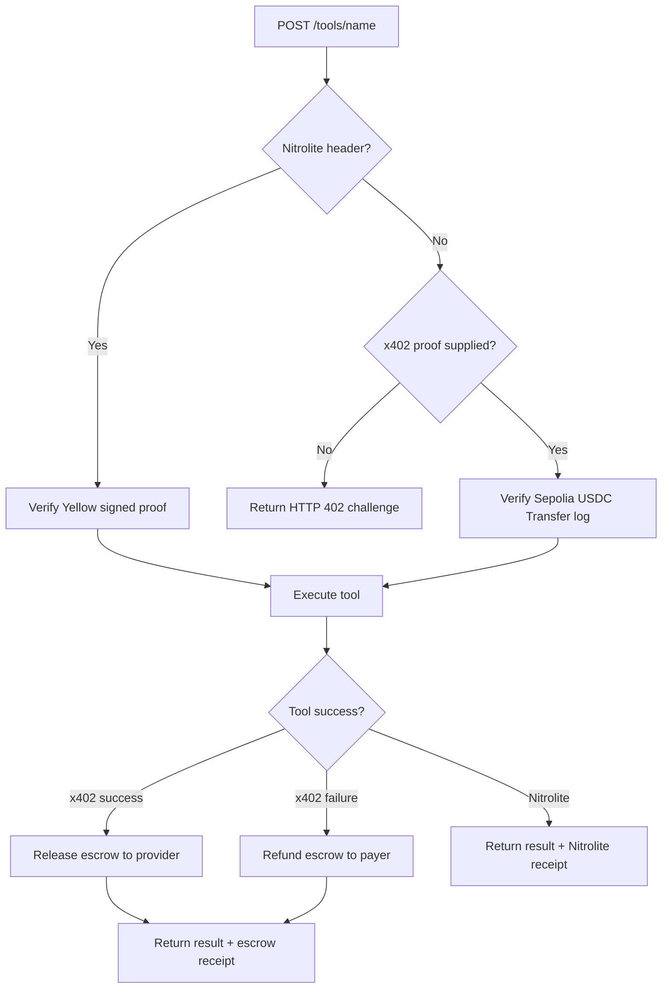

# Agent402 Architecture

## What this project does

Agent402 is a paid AI-tool marketplace. A user asks the React application for
help. Gemini chooses from the currently approved tools, the frontend pays for
each selected tool, and the backend executes the tool only after payment
verification. Results and a payment receipt are then returned to the user.

There are two payment routes:

- **x402 / Sepolia escrow:** on-chain USDC payment, verified by the backend
  and released to the provider or refunded after execution.
- **Yellow Nitrolite:** a signed off-chain state-channel update, verified by
  the backend before the tool is allowed to run.

USDC has 6 decimals. The configured on-chain network is Ethereum Sepolia
(chain ID `11155111`).

## Component map

| Component | Responsibility |
| --- | --- |
| `AgentPayFrontend/` | React/Vite UI, agent chat loop, wallet and payment UX. |
| `MarketplaceBackend/` | FastAPI API, tool catalogue, payment verification, tool execution and escrow settlement. |
| MongoDB | Persistent records for registered tools and their approval status. |
| Gemini 2.5 Flash | Response generation and selection of suitable marketplace tools. |
| `AgentPayEscrow.sol` | Holds transferred USDC until release to a provider or refund to the payer. |
| Tool providers | Remote HTTP endpoints or JavaScript code executed by the backend. |

## Frontend behaviour

The React app has four routes: `/` (landing), `/agent` (agent chat),
`/marketplace` (catalogue), and `/add-tool` (tool submission).

`src/config/env.js` reads `VITE_MARKETPLACE_URL`, defaulting to
`http://localhost:3000`. Vite normally uses port 5173, and the backend CORS
configuration explicitly allows both `http://localhost:5173` and 5174.

When the agent page opens, `AgentInterface` does two things:

1. It sends a lightweight wake-up request to the marketplace URL.
2. It calls `GET /tools`, converts each approved tool into a Gemini function
   declaration, and saves price/provider details for payment.

Chat sessions are browser-only data stored in `localStorage`; the API does not
persist user conversations or receipts.

## Backend startup and tool catalogue

`main.py` builds the FastAPI app, adds CORS, and registers three routers:
`info`, `gemini`, and `tools`. During application startup it:

1. Creates the Motor MongoDB client.
2. Starts a serial worker for escrow transactions.
3. Reads every MongoDB tool with `status: approved` and builds an in-memory
   registry.

The third step is important operationally. The process may exist before it is
usable: FastAPI accepts requests only after this MongoDB catalogue load finishes.
In the local run, the MongoDB load added roughly 17 seconds. Treat
`Application startup complete` as the ready signal, rather than the earlier
Uvicorn process message.

Tools move through this lifecycle:

`registry.py` has three caches loaded from MongoDB:

- `dynamic_routes`: payment metadata for `/tools/{name}`.
- `registered_proxies`: a remote target URL or a code-file path plus provider metadata.
- `marketplace_tools`: the small public catalogue returned to the frontend and Gemini.

| Endpoint | Role |
| --- | --- |
| `GET /health`, `/ping`, `/escrow-info` | Liveness and on-chain configuration. |
| `GET /tools`, `/tools/info` | Approved marketplace catalogue. |
| `POST /tools/register` | Create a pending tool. |
| `POST /tools/{name}/approve` | Approve and hot-load a tool. |
| `POST /tools/{name}` | Require payment, execute the tool and return a receipt. |
| `POST /gemini/chat` | Ask Gemini for text and/or tool function calls. |

## End-to-end agent loop

The browser orchestrates the multi-turn conversation; the backend provides the
Gemini endpoint and the paid tool endpoints.

`routers/gemini.py` sanitizes incoming tool names and schemas, creates Gemini
function declarations, and calls `gemini-2.5-flash` in a worker thread. Its
system prompt tells Gemini to explain its plan, select the least-cost
equivalent tool, parallelize independent calls, and chain dependent calls.

## Paid tool request

All paid calls use `POST /tools/{name}`. The backend looks up the approved tool,
calculates the atomic USDC price, then selects a payment branch from the
request headers.

### x402 escrow flow

1. The frontend first POSTs the desired tool request without a payment proof.
2. The backend returns HTTP 402 with the escrow address, USDC token address,
   atomic price, chain ID and tool-provider wallet.
3. The browser wallet transfers USDC to the escrow contract on Sepolia and
   waits for confirmation.
4. It retries with `X-Payment` and `X-Payment-Tx` headers.
5. `payment_verifier.py` fetches the transaction receipt, finds a USDC
   `Transfer` event, and verifies that the recipient is the escrow contract
   and the amount covers the required price.
6. The backend executes the tool.
7. If `ESCROW_PRIVATE_KEY` is configured, `escrow_service.py` queues a release
   to the provider on success or a refund to the payer on failure. A single
   queue worker prevents EVM nonce collisions.
8. The response body includes `escrowReceipt`; the API also exposes the same
   data in `X-Payment-Receipt`.

`geminiService.js` implements this route for the main agent interface.
`src/workers/toolWorker.js` implements the same x402 sequence in a Web Worker
so payment progress does not block the UI.

### Nitrolite state-channel flow

When a funded Yellow channel is available, the frontend creates a signed
off-chain allocation and sends it with `X-Payment-Method: nitrolite`,
`X-Nitrolite-Proof`, and payer headers.

`nitrolite_verifier.py` decodes the proof, recovers the ECDSA payer signature,
checks the payer/provider addresses, USDC allocation, minimum price, tool name,
protocol and session ID. Only then does the backend run the tool. There is no
on-chain release/refund transaction in this path; the verified channel proof is
the payment evidence.

## Tool execution

| Tool type | Execution model |
| --- | --- |
| `proxy` | The backend makes an async JSON POST to `targetUrl` with a 15-second HTTP timeout. |
| `code` | The backend writes/normalizes JavaScript in `user_tools/` and launches a Node.js subprocess with a 30-second timeout. |

Untrusted code tools use a minimal CommonJS shim. Trusted tools are imported
as ESM. In both cases, code runs on the backend host with its environment, so
approving code tools is a security-sensitive administrator action.

## Persistence, secrets and contract

MongoDB persists tool metadata: name, description, price, parameter schema,
provider target or source code, provider wallet, approval status and trust
flag. The backend environment supplies `MONGODB_URI`, `GEMINI_API_KEY`,
`SEPOLIA_RPC`, `ESCROW_CONTRACT_ADDRESS`, `ESCROW_PRIVATE_KEY`, and optional
provider keys. Frontend-visible values must be intentionally prefixed `VITE_`.
Keep private keys and API keys out of source control.

`AgentPayEscrow.sol` is the USDC custody layer. Its owner can release to a
provider or refund a payer, while registered deposits also support timeout
refunds. The Python backend is the policy/execution layer: it verifies the
payment, runs the tool, then chooses release or refund.

## Local readiness checklist

1. Start the backend with `venv/bin/uvicorn main:app --host 0.0.0.0 --port 3000 --reload`.
2. Wait for `Application startup complete`.
3. Check `http://localhost:3000/health` and `GET /tools`.
4. Start Vite and set `VITE_MARKETPLACE_URL=http://localhost:3000`.
5. For x402, fund the browser wallet with Sepolia ETH for gas and Sepolia USDC;
   configure the backend escrow-owner key to enable release/refund.
6. For Nitrolite, connect and fund a compatible Yellow channel. Otherwise the
   frontend falls back to the Sepolia escrow route.
